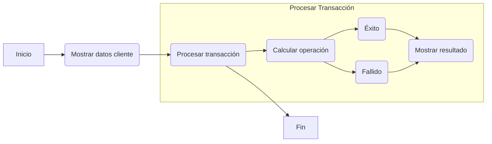

# Documentación de Modernización: HolaMundo

## 1. Resumen Funcional
El programa COBOL 'Gestión de Saldo' realiza transacciones financieras en cuenta corriente. Muestra el nombre del cliente, su saldo inicial y las transacciones realizadas. Simula una operación de retiro o depósito según un código de transacción.

## 2. Glosario de Variables Bancarias
- **WS-SAL-ACT**: Saldo Actual
- **WS-ID-CLI**: Identificación del Cliente
- **WS-NOM**: Nombre del Cliente
- **WS-MON**: Monto de la Transacción
- **WS-TIP-TRAN**: Tipo de Transacción

## 3. Reglas de Negocio Detectadas
- Si el tipo de transacción es 'D', se suma el monto al saldo actual.
- Si el tipo de transacción es 'R', se resta el monto del saldo actual siempre que este sea suficiente.

## 4. Diagrama de Proceso (BPMN)

