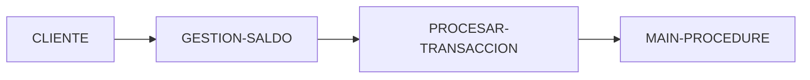

# Documentación de Modernización: HolaMundo

## 1. Resumen Funcional
El programa gestiona los saldos de los clientes, mostrando el saldo inicial, procesando una transacción de depósito o retiro y mostrando el saldo final. Utiliza un código de transacción para determinar el tipo de operación y realizar cálculos financieros básicos.

## 2. Glosario de Variables Bancarias
- **WS-SAL-ACT**: Saldo Actual
- **WS-CLIENTE**: Información del Cliente
- **WS-TRANSACCION**: Detalles de la Transacción
- **WS-MENSAJE-SALIDA**: Mensaje de Salida

## 3. Reglas de Negocio Detectadas
- Si el tipo de transacción es 'D', se suma el monto de la transacción al saldo actual.
- Si el tipo de transacción es 'R', se resta el monto de la transacción del saldo actual, siempre y cuando el saldo sea suficiente.

## 4. Diagrama de Proceso (BPMN)

