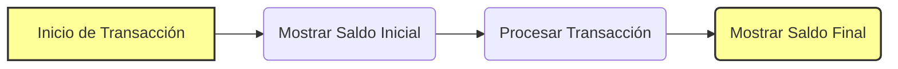

# Documentación de Modernización: HolaMundo

## 1. Resumen Funcional
El programa gestiona los saldos de los clientes, mostrando el saldo inicial, procesando una transacción de retiro o depósito y mostrando el saldo final. Utiliza un mensaje de texto simple para indicar el éxito o fracaso de la operación.

## 2. Glosario de Variables Bancarias
- **WS-SAL-ACT**: Saldo Actual
- **WS-CLIENTE**: Datos del cliente
- **WS-TRANSACCION**: Detalles de la transacción

## 3. Reglas de Negocio Detectadas
- Si el tipo de transacción es 'D', se suma el monto al saldo actual.
- Si el tipo de transacción es 'R', se resta el monto del saldo actual, siempre que el saldo sea suficiente.
- Se realiza una validación financiera para asegurar que el saldo sea suficiente en los retiros.

## 4. Diagrama de Proceso (BPMN)

