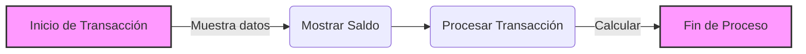

# Documentación de Modernización: HolaMundo

## 1. Resumen Funcional
El programa COBOL 'Gestión de Saldo' muestra el nombre y saldo inicial de un cliente, simula una transacción de retiro o depósito en función del tipo de transacción ingresado, y realiza los cálculos correspondientes. Luego, muestra un mensaje de éxito/fallo y el saldo final actualizado.

## 2. Glosario de Variables Bancarias
- **WS-SAL-ACT**: Saldo Actual
- **WS-CLIENTE**: Información del Cliente
- **WS-TRANSACCION**: Detalles de la Transacción

## 3. Reglas de Negocio Detectadas
- Si el tipo de transacción es 'D', se suma el monto a WS-SALDO-ACTUAL
- Si el tipo de transacción es 'R', se resta el monto de WS-SALDO-ACTUAL siempre que el saldo sea suficiente

## 4. Diagrama de Proceso (BPMN)

